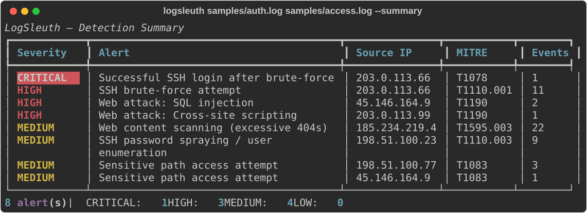

# 🔍 LogSleuth

> A log analyzer & detection engine for SOC / blue teams. Parses Linux **auth logs** and **web access logs**, detects common attacks, and maps every finding to **MITRE ATT&CK**.

Turns raw, noisy log files into a prioritised list of alerts — the kind of first-pass triage a SOC analyst does by hand. Point it at `auth.log` and an access log and it will surface brute-force attempts, breaches, password spraying, web scanning and injection attempts, each tagged with its ATT&CK technique.



---

## ✨ Features

- **Two log sources** — Linux `auth.log` (SSH) and Apache/Nginx **combined** access logs, with IPv4 and IPv6 source addresses.
- **6 detection rules**, each mapped to MITRE ATT&CK:

  | Detector | Detects | ATT&CK |
  |----------|---------|--------|
  | SSH brute-force | many failed logins from one IP in a time window | `T1110.001` |
  | SSH password spraying | one IP trying many usernames | `T1110.003` |
  | Successful login after brute-force | login from an IP that just failed repeatedly (**breach**) | `T1078` |
  | Web attack signatures | SQLi / XSS / path traversal / command injection in the request path or User-Agent (each type reported, even when one request carries several) | `T1190` |
  | Web content scanning | excessive `404`s from one IP (dir brute-forcing) | `T1595.003` |
  | Sensitive path access | probes for `.env`, `.git`, `wp-login`, admin panels | `T1083` |

- **Severity ranking** — `CRITICAL → HIGH → MEDIUM → LOW`, most serious first.
- **Multiple outputs** — rich console, compact summary table, JSON (for SIEM/SOAR), and a standalone HTML report.
- **Automation-friendly** — exits `1` when any HIGH/CRITICAL alert is found (great for cron/CI).
- **No external services or API keys** — 100% offline, pure Python.

## 🚀 Installation

```bash
git clone https://github.com/defamp/logsleuth.git
cd logsleuth
pip install -r requirements.txt
pip install -e .        # optional: installs the `logsleuth` command
```

Requires Python 3.8+.

## 📖 Usage

```bash
# Analyze the bundled samples:
python -m logsleuth samples/auth.log samples/access.log

# Compact summary table:
logsleuth samples/auth.log samples/access.log --summary

# Only show serious alerts:
logsleuth /var/log/auth.log --min-severity high

# Pipe from another tool:
zcat /var/log/nginx/access.log.*.gz | logsleuth --summary

# Machine-readable / reporting:
logsleuth samples/auth.log --json > alerts.json
logsleuth samples/access.log --html report.html

# Tune the brute-force sensitivity:
logsleuth /var/log/auth.log --bruteforce-threshold 5
```

### Options

| Flag | Description |
|------|-------------|
| `--summary` | Compact one-row-per-alert table |
| `--json` | JSON to stdout (redirect to save) |
| `--html PATH` | Write a standalone HTML report |
| `--min-severity {info,low,medium,high,critical}` | Filter by minimum severity |
| `--bruteforce-threshold N` | Failed SSH logins per IP before alerting (default 10) |
| `--year YYYY` | Year of the first `auth.log` line (syslog has no year). Default: current year; timestamps roll over at New Year automatically |
| `--no-color` | Disable coloured output |

## 🗂️ Project structure

```
logsleuth/
├── cli.py            # argparse entry point
├── engine.py         # parse -> detect orchestration
├── models.py         # Event, Alert, Severity, MITRE mapping
├── report.py         # console / JSON / HTML output
├── parsers/          # auth.log + web access-log parsers
└── detectors/        # one module per detection rule
tests/                # offline unit tests (pytest)
samples/              # example logs with embedded attacks
```

Adding a new detector is a matter of subclassing `BaseDetector`, implementing
`run(events)`, and registering it in `detectors/__init__.py`.

## 🧪 Tests

```bash
pip install pytest
pytest -q
```

All tests are offline and run against the bundled sample logs.

## ⚠️ Disclaimer

Built for **defensive** log analysis on systems you are authorised to monitor. The sample logs contain simulated, harmless attack patterns for demonstration.

## 📄 License

MIT © Defa Mulya Pratama
